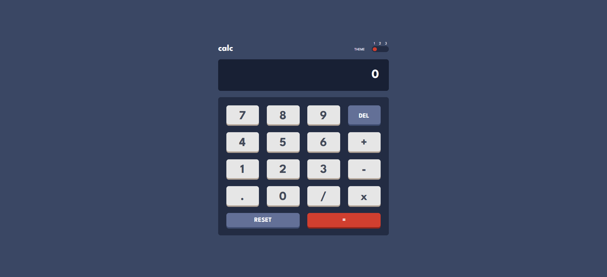
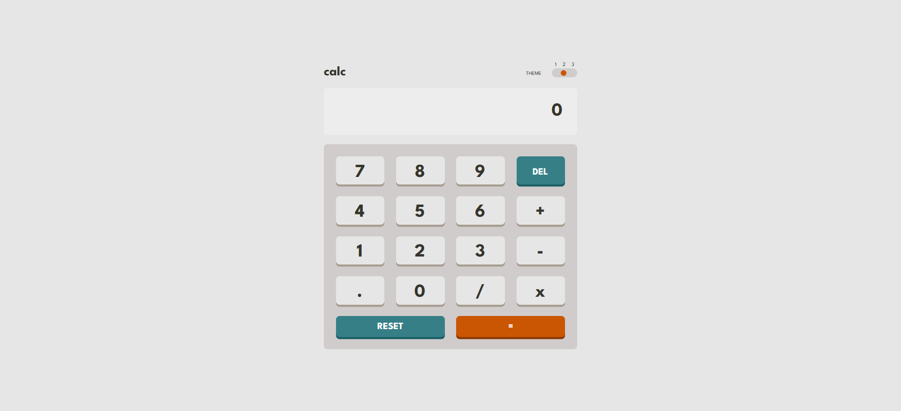
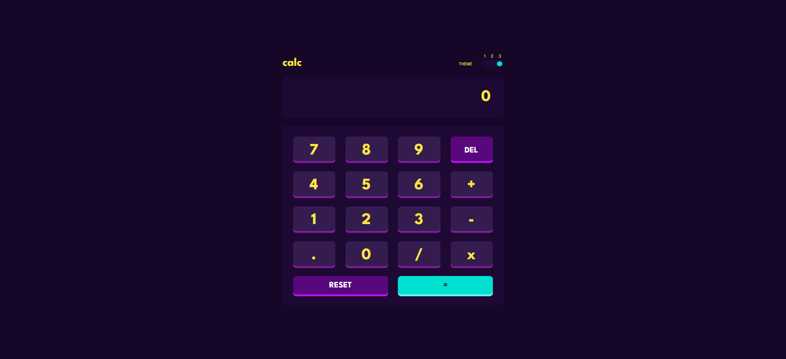

# Frontend Mentor - Calculator app solution

This is a solution to the [Calculator app challenge on Frontend Mentor](https://www.frontendmentor.io/challenges/calculator-app-9lteq5N29). Frontend Mentor challenges help you improve your coding skills by building realistic projects.

## Table of contents

- [Overview](#overview)
  - [The challenge](#the-challenge)
  - [Screenshot](#screenshot)
  - [Links](#links)
- [My process](#my-process)
  - [Built with](#built-with)
  - [What I learned](#what-i-learned)
  - [AI Collaboration](#ai-collaboration)
- [Author](#author)

## Overview

### The challenge

Users should be able to:

- See the size of the elements adjust based on their device's screen size
- Perform mathmatical operations like addition, subtraction, multiplication, and division
- Adjust the color theme based on their preference
- **Bonus**: Have their initial theme preference checked using `prefers-color-scheme` and have any additional changes saved in the browser

### Screenshot

#### Theme 1



#### Theme 2



#### Theme 3



## My process

### Links

- Solution URL: [https://www.frontendmentor.io/solutions/calculator-app-s7i-wcOC7I]
- Live Site URL: [https://reem-a-hikal.github.io/calculator-app/]

### Built with

- Semantic HTML5 markup
- CSS custom properties
- Flexbox
- CSS Grid
- Mobile-first workflow
- Vanilla JavaScript
- CSS Nesting
- localStorage

### What I learned

"I learned how to use CSS Custom Properties for theming, Event Delegation for handling button clicks, and how to manage calculator state in JavaScript."

```js
const handleDefaultTheme = (e) => {
  const savedTheme = localStorage.getItem("theme");
  document.body.dataset.theme = savedTheme || (e.matches ? "1" : "2");
};

const mediaQuery = globalThis.matchMedia("(prefers-color-scheme: dark)");
mediaQuery.addEventListener("change", handleDefaultTheme);
handleDefaultTheme(mediaQuery);
```

## Author

- Github - [@Reem-A-Hikal](https://github.com/Reem-A-Hikal)
- Frontend Mentor - [@Reem Atef](https://www.frontendmentor.io/profile/Reem-A-Hikal)
- LinkedIn - [@Reem Heikal](https://www.linkedin.com/in/reem-heikal/)
